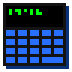

# Calc86
A small scientific calculator app by Dylan Sharhon

https://dsharhon.github.io/calc86/

## Features
* No nonsense minimalist mobile interface
* Numerical expressions and functions
* Complex numbers
* <a href="https://commons.wikimedia.org/wiki/File:Unit_relations_in_the_new_SI.svg#/media/File:Unit_relations_in_the_new_SI.svg">Physical constants</a>

## Todo
* Matrix math
* Symbolic math (solver, simplifier, calculus, etc.)
* Compact physical constant symbols
* Alternate unit modes (degrees, eV)
* Keyboard input for PC use
* Save state between page loads

## Credits
* [math.js](https://mathjs.org/) by [Jos de Jong](https://github.com/josdejong) et al. 
* [More Perfect DOS VGA](https://laemeur.sdf.org/fonts/) by Zeh Fernando and LÆMEUR
